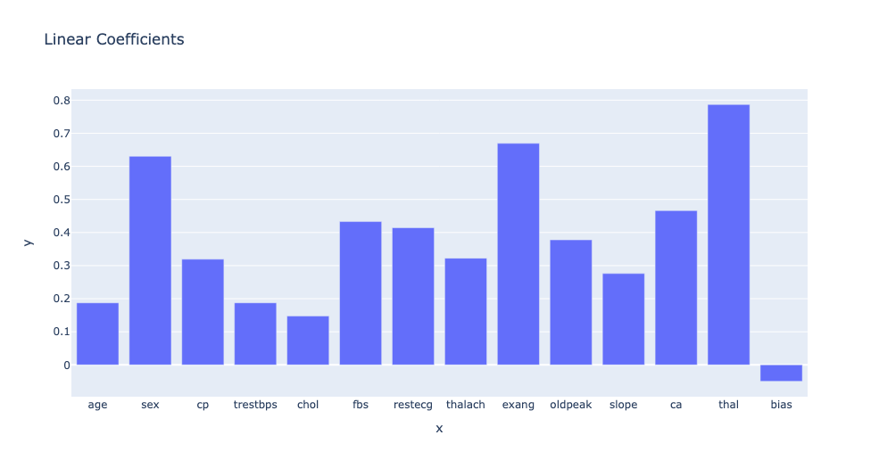
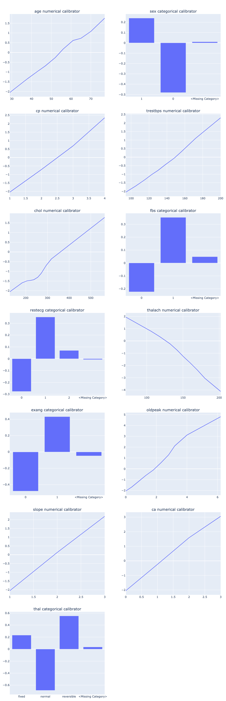

# UCI Statlog (Heart) Walkthrough


You can find a Jupyter Notebook [here](../notebooks/uci\_statlog\_heart\_example.ipynb) with matching content.


## Setup

Before getting started, make sure to install the following packages for import if you're following along. To install the SOTAI SDK, simply run `pip install sotai`.

```python
import math
import plotly.express as px
import plotly.subplots as sp
import pandas as pd
import sotai
```

Next let's load the UCI Statlog (Heart) dataset into a pandas DataFrame. This dataset has the following columns:

* age (numerical): the age of the patient in years
* sex (categorical): a 0/1 variable representing biological sex assigned at birth
* cp (numerical): chest pain type (4 values)
* trestbps (numerical): resting blood pressure
* chol (numerical): serum cholesterol in mg/dl
* fbs (categorical): fasting blood sugar > 120 mg/dl
* restecg (categorical): resting electrocardiographic results (values 0,1,2)
* thalach (numerical): maximum heart rate achieved
* exang (categorical): exercise induced angina
* oldpeak (numerical): ST depression induced by exercise relative to rest
* slope (numerical): the slope of the peak exercise ST segment
* ca (numerical): number of major vessels (0-3) colored by fluoroscopy
* thal: normal; fixed defect; reversible defect
* target: absense or presence of heart disease (what we are trying to predict)

```python
heart_data = pd.read_csv(
    "http://storage.googleapis.com/download.tensorflow.org/data/heart.csv"
)
# Convert numerical categories to strings so they are handled as categories
categorical_features = ["sex", "fbs", "restecg", "exang", "thal"]
heart_data[categorical_features] = heart_data[categorical_features].astype(str)
# Clean the thal feature categories
heart_data["thal"].replace({"1": "fixed", "2": "reversible"}, inplace=True)
```

Now that we've loaded and cleaned our data, we're ready to configure a SOTAI Pipeline for training calibrated models:

```python
heart_pipeline = sotai.Pipeline(
    features=[
        "age", "sex", "cp", "trestbps", "chol", "fbs", "restecg",
        "thalach", "exang", "oldpeak", "slope", "ca", "thal",
    ],
    target="target",
    target_type="classification",
    categories={
        "sex": list(heart_data["sex"].unique())
    }
)
heart_pipeline.shuffle_data = False  # more repeatable results
# Constrain age, chol, and trestbps to have a monotonically increasing relationship
# with the target i.e. increasing the feature will increase the predicted probability
# of heart disease, all else being equal
heart_pipeline.feature_configs["age"].monotonicity = "increasing"
heart_pipeline.feature_configs["chol"].monotonicity = "increasing"
heart_pipeline.feature_configs["trestbps"].monotonicity = "increasing"
# Constrain thalach to have a monotonically decreasing relationship with the target
# i.e. higher maximum achieved heart rate decreases likelihood of heart disease,
# all else being equal
heart_pipeline.feature_configs["thalach"].monotonicity = "decreasing"
```

Next, simply train a calibrated linear model (using defaults for the remaining configuration options):

```python
trained_model = heart_pipeline.train(heart_data)
```

The resulting trained model contains both the model itself as well as the results. Let's take a look at our primary metric (which defaults to AUC for classification tasks):

```python
train_auc = trained_model.training_results.train_primary_metric_by_epoch[-1]
val_auc = trained_model.training_results.val_primary_metric_by_epoch[-1]
test_auc = trained_model.training_results.test_primary_metric
print(f"Train AUC: {train_auc}")  # 0.9371488094329834
print(f"Val AUC: {val_auc}")  # 0.8400000333786011
print(f"Test AUC: {test_auc}")  # 0.9159663319587708
```

We can also look at the linear coefficients of our trained model:

```python
x, y = list(zip(*trained_model.training_results.linear_coefficients.items()))
fig = px.bar(x=x, y=y, title="Linear Coefficients")
fig.show(renderer="notebook")
```

<figure><figcaption><p>Looks like our models thinks sex, exang, and thal are the three most important features.</p></figcaption></figure>

Each feature in a calibrated linear model goes through a calibrator (piece-wise linear function). We can also graph these calibrators to visualize and better understand how our model is handling each feature:

```python
feature_analyses = trained_model.training_results.feature_analyses
sub_figures = []
for feature, analysis in feature_analyses.items():
    if analysis.feature_type == "categorical":
        sub_figures.append(px.bar(
            x=feature_analyses[feature].keypoints_inputs_categorical,
            y=feature_analyses[feature].keypoints_outputs,
            title=f"{feature} categorical calibrator",
        ))
    else:
        sub_figures.append(px.line(
            x=feature_analyses[feature].keypoints_inputs_numerical,
            y=feature_analyses[feature].keypoints_outputs,
            title=f"{feature} numerical calibrator",
        ))
    
cols = 2
subplot_titles = [sf._layout["title"]["text"] for sf in sub_figures]
fig = sp.make_subplots(
    rows=math.ceil(len(sub_figures)/cols),
    cols=cols,
    subplot_titles=subplot_titles,
    vertical_spacing=0.025
)
for i, sf in enumerate(sub_figures):
    for trace in range(len(sf["data"])):
        fig.add_trace(sf["data"][trace], row=i//cols + 1, col=i%cols + 1)

fig.update_layout(height=3000, margin=dict(l=20, r=20, t=60, b=20))
fig.show(renderer="notebook")
```

<figure><figcaption><p>Now we can see beyond importance into how the model handles each feature before combining them. This is particularly useful for categorical variables.</p></figcaption></figure>
