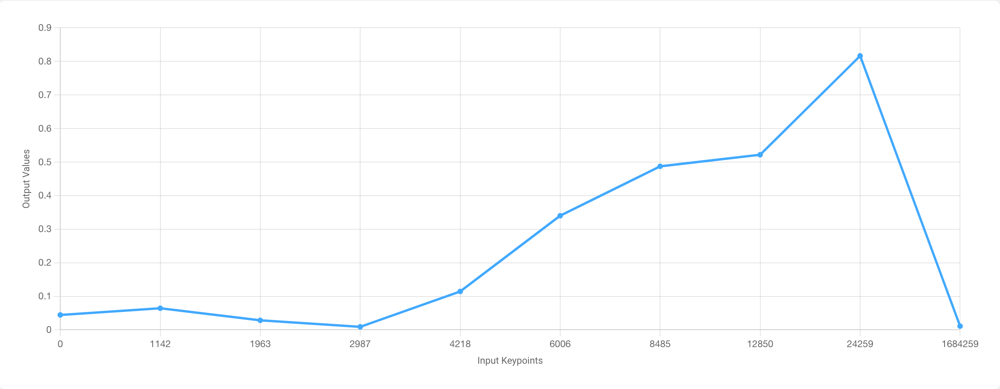
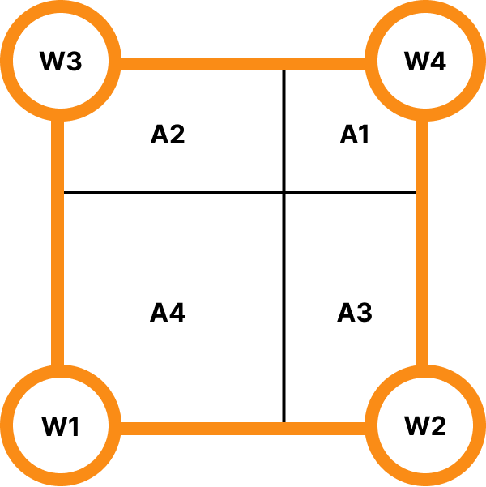
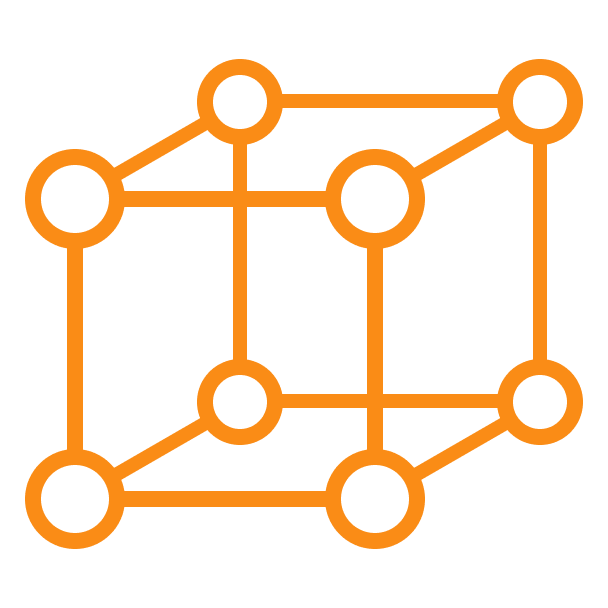

# What Is Calibrated Modeling?

Calibrated Models are machine learning models that, by their construction, provide a level of interpretability that you can't find with black-box models (e.g. a deep neural net). All calibrated models (linear, lattice, ensemble) have an initial layer that we call the calibration layer. This calibration layer calibrates each input individually for the later layers in the model. For example, a calibrated linear model will first calibrate each input with its own respective calibrator and then combine the calibrated inputs with a simple linear combination. These calibrators handle both numerical feature values as well as categorical feature values.

<figure><figcaption>
Categorical Calibrator
</figcaption></figure>

 

<figure><figcaption>
Numerical Calibrator
</figcaption></figure>

As we can see from the calibrator examples above, each input gets mapped to its calibrated value either through a categorical mapping or through a piece-wise linear function. Unlike DNNs that are sensitive to the magnitude of the input values (e.g. larger values have more impact and need to be normalized), calibrated models handle any magnitude of input well since each input gets calibrated into a more normalized range.

Both categorical and numerical calibrators can also have their shape constrained to provide certain guarantees. For example, we can constrain the calibrator to be monotonically increasing simply by forcing the piece-wise linear function to be monotonically increasing during training.

But that's just the calibrator. How do we provide end-to-end guarantees? The calibrators we've just discussed are what we call 1-dimensional calibrators -- they operate on a single, 1-dimensional input. But we can extend these calibrators to operate on multiple dimensions. A Lattice is the n-dimensional extension of these calibrators, which are hypercubes. It's difficult to visualize an n-dimensional hypercube, but we can use the 2-dimensional and 3-dimensional cases to better understand what's happening.

<figure><figcaption>
2-Dimensional Lattice (2 Input Features)
</figcaption></figure>

 

<figure><figcaption>
3-Dimensional Lattcie (3 Input Features)
</figcaption></figure>

The way we calculate the output for a lattice layer is by multiplying each parameter (W) by the opposite area (A) and taking the sum. The reason for this is that we want an input that is closer to a parameter to give that parameter more weight -- as an input gets closer to W4, A4 will increase, which is what we want.

Similar to how we can constrain the shape of a one-dimensional calibrator, we can constrain the shape of the n-dimensional calibrator to provide end-to-end guarantees. For example, constraining the parameters for the two-dimensional lattice to be increasing for a particular input dimension (e.g. W1 < W2, W3 < W4) will maintain the increasingly monotonic shape end-to-end. Notice that by doing so we are guaranteeing that as we increase that inputs dimension, we are increasing the area for the larger parameters (e.g. W2 and W4) and decreasing the weight for the smaller parameters (e.g. W1 and W3). This guarantees that increasing the value for that input dimension will increase the output of the lattice layer, which is exactly the increasingly monotonic shape constraint that we're looking for. We can then extend this methodology to the n-dimensional case to handle more features.

Hopefully this makes it clear how calibrated modeling provides interpretability through its structure, which is exactly what makes black-box models opaque. This structure provides the ability not only to constrain the model's function shape but also to look inside and analyze the model to better understand how it makes its predictions.

## Related Research Papers

* [Monotonic Kronecker-Factored Lattice](https://openreview.net/forum?id=0pxiMpCyBtr), William Taylor Bakst, Nobuyuki Morioka, Erez Louidor, International Conference on Learning Representations (ICLR), 2021
* [Multidimensional Shape Constraints](https://proceedings.mlr.press/v119/gupta20b.html), Maya Gupta, Erez Louidor, Oleksandr Mangylov, Nobu Morioka, Taman Narayan, Sen Zhao, Proceedings of the 37th International Conference on Machine Learning (PMLR), 2020
* [Deontological Ethics By Monotonicity Shape Constraints](https://arxiv.org/abs/2001.11990), Serena Wang, Maya Gupta, International Conference on Artificial Intelligence and Statistics (AISTATS), 2020
* [Shape Constraints for Set Functions](http://proceedings.mlr.press/v97/cotter19a.html), Andrew Cotter, Maya Gupta, H. Jiang, Erez Louidor, Jim Muller, Taman Narayan, Serena Wang, Tao Zhu. International Conference on Machine Learning (ICML), 2019
* [Diminishing Returns Shape Constraints for Interpretability and Regularization](https://papers.nips.cc/paper/7916-diminishing-returns-shape-constraints-for-interpretability-and-regularization), Maya Gupta, Dara Bahri, Andrew Cotter, Kevin Canini, Advances in Neural Information Processing Systems (NeurIPS), 2018
* [Deep Lattice Networks and Partial Monotonic Functions](https://research.google.com/pubs/pub46327.html), Seungil You, Kevin Canini, David Ding, Jan Pfeifer, Maya R. Gupta, Advances in Neural Information Processing Systems (NeurIPS), 2017
* [Fast and Flexible Monotonic Functions with Ensembles of Lattices](https://papers.nips.cc/paper/6377-fast-and-flexible-monotonic-functions-with-ensembles-of-lattices), Mahdi Milani Fard, Kevin Canini, Andrew Cotter, Jan Pfeifer, Maya Gupta, Advances in Neural Information Processing Systems (NeurIPS), 2016
* [Monotonic Calibrated Interpolated Look-Up Tables](http://jmlr.org/papers/v17/15-243.html), Maya Gupta, Andrew Cotter, Jan Pfeifer, Konstantin Voevodski, Kevin Canini, Alexander Mangylov, Wojciech Moczydlowski, Alexander van Esbroeck, Journal of Machine Learning Research (JMLR), 2016
* [Optimized Regression for Efficient Function Evaluation](http://ieeexplore.ieee.org/document/6203580/), Eric Garcia, Raman Arora, Maya R. Gupta, IEEE Transactions on Image Processing, 2012
* [Lattice Regression](https://papers.nips.cc/paper/3694-lattice-regression), Eric Garcia, Maya Gupta, Advances in Neural Information Processing Systems (NeurIPS), 2009
